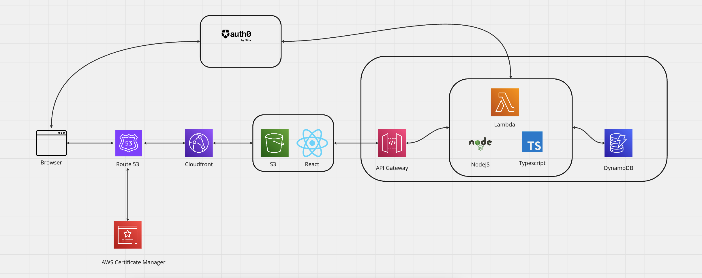

# React Todo App.

A complete todo application with all features and IaC (Infrastructure as Code) for deployment into serverless architecture hosted in AWS, using Auth0 as the provider for OAuth 2.0 authorization.

---

## Project Description

This is a complete application with:

- Front end (React, Framer Motion, S3)
- Back end (API Gateway, Lambda)
- Database (DynamoDB)
- User authentication and authorisation (Auth0)
- Content Delivery Network (Cloudfront)
- Custom DNS (Route 53, AWS Certificate Manager)

Click the following link to see a production deployment of it:

[todos.patrickmorton.co.uk](https://todos.patrickmorton.co.uk)

## Features

This a production application with authentication via Auth0 that enables users to securely use the application, which will store todos in dynamodb. Users can do the following actions with todos:

- create
- update
- delete
- reorder

The reordering animation leverages the Framer Motion react library, and uses a debounced function that will save to the back end when no more changes are detected after a second.

## Architecture

Here is a diagram of the project architecture:



## Local development

### Environment Variables

Run 

```
cp .env.dev.example .env.dev
```

### Auth

It is possible to run the application in the local environment with or without auth (authentication + authorisation). In order to run without, set the following environment variable in the `.env` file to bypass auth in the front and back in infrastructure:

```
REACT_APP_AUTH=false
```

If you wish to run the application with auth locally, you will need to  and also . When done, the following environment variables need to be set in `.env`:

```
REACT_APP_AUTH0_DOMAIN=dev-example.us.auth0.com
REACT_APP_AUTH0_CLIENT_ID=somehash
REACT_APP_AUTH0_AUDIENCE=http://localhost:[FRONT_END_PORT]
```

### Front-end

The front-end of the application (the static website created using React) can be built and run using the command:

```
npm run dev
```

NOTE: by default this will run on localhost port 3000; this can be changed by setting the `LOCAL_DEV_PORT` envrionment variable in the `.env` file.

### Back-end

The back-end of the application (the API consisting of API Gateway, Lambda and DynamoDB) can deployed locally. 

This relies on the user having the AWS SAM CLI installed, by following the instructions [here](https://docs.aws.amazon.com/serverless-application-model/latest/developerguide/install-sam-cli.html)

(Note: SAM is a different framework to CDK, which is used to deploy the application into AWS, however it can still use CDK generated cloudformation templates to build local APIs). 

The back end API can then be spun up by running the following command:

```
npm run dev:api
```

NOTE: the port to run the API on also needs to be set locally in the `LOCAL_API_PORT` variable in the `.env` file. 

## Deployment

The framework used to deploy the application is AWS CDK. An AWS account and programmatic access configured locally for the target account is required. See steps 1 & 2 of  for more information on how to set this up. 

Run the following command to create the env file

```
cp .env.prod.example .env.prod
```
The deployment will not create a Route53 domain or DNS certificate Amazon Certificate Manager, as both of these take a while to create and generally do not change so it makes sense to create them manually and reference them in the stack. When you have created these update the relevant environment vars in `.env.prod` to reference them:

```
DOMAIN_NAME=todos.patrickmorton.co.uk
CERTIFICATE_ARN=arn:aws:acm:Region:444455556666:certificate/certificate_ID
```

When deployed, an endpoint for the API will be generated and output in the terminal. This endpoint will need to be set to the following environment variables in `.env.prod` and the deployment process run again:

```
REACT_APP_API_URL=https://example.execute-api.eu-west-2.amazonaws.com/prod
```